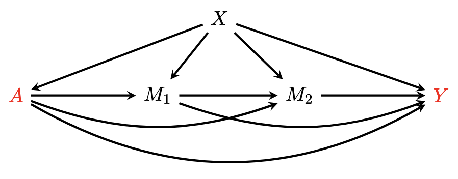
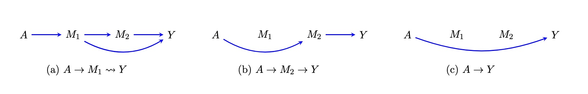
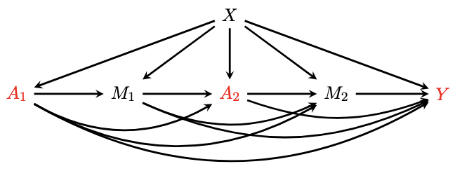
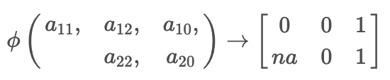

```{r setup, include=FALSE}
library(knitr)
opts_chunk$set(warning = FALSE, message = FALSE, eval= T,collapse = T)
```

This package is built for estimating the causal **path-specific effects** (PSEs) in mediation analysis with <span style="color:red">multiple ordered mediators for one binary treatment or multiple binary treatments</span>. It provides robust estimators based on influence function theory.

Primary advantages of the package include:

- **Flexible model size**: The number of treatment(s) and mediator(s) is flexible.

- **Flexible decomposition**: This package can return the Natural PSEs and Cumulative PSEs via each mediator ([Xiang Zhou, 2022](https://academic.oup.com/jrsssb/article/84/3/794/7056148)).

- **Flexible pathways**: User can calculate the average potential outcome for any identified pathway(s), as well as the average causal effect by comparing two potential outcome.

- **Flexible models**: The package supports model fitting using `glm/lm`, `dbarts`, `SuperLearner` now. Users can also integrate new models for estimation by modifying the `fl_model_template.R`.

- **Flexible estimators**: This package includes three estimators—Inverse Probability Weighting (IPW), plug-in G-computation, and Efficient Influence Function (EIF). The EIF estimator enhances robustness against model misspecification, ensuring more reliable results.

Quick instructions are provided below. For more details, see the html in vignettes.

# 0. Installation:

```{r, eval=FALSE}
install.packages("devtools")
library(devtools)

install_github("xxou/flexPaths")
library(flexPaths)
```

```{r, eval=T,echo=FALSE}
library(flexPaths)
```

# 1. Quick example: Single Treatment

Here, we illustrate the case with two mediators $M_1$ and $M_2$ (the mediator can be high dimensional). Let $A$ denote the binary treatment (0 or 1), $Y$ denote the outcome, and $X$ denote the covariates.

{width="400"}

Denote the counterfactual outcome $\phi(a_1, a_2, a) = Y(a,M_1(a_1),M_2(a_2,M_1(a_1)))$ that would be observed if $A$ were set to $a$ and $M_1$ and $M_2$ were set to the natural value they would have taken if $A$ had been $a_1$ and $a_2$, where $(a_1, a_2, a) \in \{0,1\}^3$. 

**Identified pathways**:

In the case of two mediators, we have three identified pathways. Using `pathsEffect`, we can obtain the effect via each mediator.

{width="1067"}

**Decomposition**:

`decomposition = "refer0"`: The effect of specific pathway can be defined as a contrast against $Y(0)$ on a mean scale, and these effects are also called natural path-specific effect:

-   $\rho_{A \rightarrow M_1 \leadsto Y} = \mathbb{E} (\phi(1,0,0)) - \mathbb{E} (\phi(0,0,0))$
-   $\rho_{A \rightarrow M_2 \rightarrow Y} = \mathbb{E} (\phi(0,1,0)) - \mathbb{E} (\phi(0,0,0))$
-   $\rho_{A \rightarrow Y} = \mathbb{E} (\phi(0,0,1)) - \mathbb{E} (\phi(0,0,0))$

`decomposition = "sequential"`: Decompose the total effect into PSEs sequentially, and these effects are also called cumulative path-specific effect: $\mathbb{E}(Y(1)) - \mathbb{E}(Y(1)) =\rho_{A \rightarrow M_1 \leadsto Y} + \rho_{A \rightarrow M_2 \rightarrow Y} + \rho_{A \rightarrow Y}$

-   $\rho_{A \rightarrow M_1 \leadsto Y} = \mathbb{E} (\phi(1,1,1)) - \mathbb{E} (\phi(0,1,1))$
-   $\rho_{A \rightarrow M_2 \rightarrow Y} = \mathbb{E} (\phi(0,1,1)) - \mathbb{E} (\phi(0,0,1))$
-   $\rho_{A \rightarrow Y} = \mathbb{E} (\phi(0,0,1)) - \mathbb{E} (\phi(0,0,0))$

In the absence of interactions between $A$ and $M$, natural PSEs and cumulative PSEs yield identical results. However, when interactions are present, they display different results except the same direct effect. Meanwhile, natural PSEs cannot be simply summed to represent the total effect. Therefore, these proportions are not analogous to the \`\`proportion mediated'' typically.


**Models for Estimation**:

-   For IPW approach: To estimate $K+1$ PSEs, we need to fit $K+1$ models to estimate propensity score $P(A|X), P(A|X,M_1), \ldots, P(A|X,M_1,\ldots,M_K)$.
-   For plug-in G computation: To estimate $K+1$ PSEs, we need to fit $K+1$ models for outcome regression $\mathbb{E}(Y|X), \mathbb{E}(Y|X,M_1), \ldots, \mathbb{E}(Y|X,M_1,\ldots,M_K)$.
-   For EIF approach: To estimate $K+1$ PSEs, we need to fit $K+1$ models to estimate both propensity score $P(A|X), P(A|X,M_1), \ldots, P(A|X,M_1,\ldots,M_K)$ and $K+1$ outcome regression $\mathbb{E}(Y|X), \mathbb{E}(Y|X,M_1), \ldots, \mathbb{E}(Y|X,M_1,\ldots,M_K)$.


## 1.1 `pathsEffect`: PSEs through each mediator
```{r}
data("singTreat")
head(singTreat)

EIF_fit <- pathsInfo(data = singTreat, A = "treat", Y = "outcome1", cov_x = c("X1", "X2"),
                    M.list = list(M1 = "med1", M2 = c('med2_1', 'med2_2')),
                    estimation = "EIF",
                    model.outcome = ~ SuperLearner(SL.library = c('SL.glm','SL.mean'),family = gaussian()),
                    model.propensity = list(cov_x = ~ bart(verbose = FALSE, ndpost = 200),
                                            M1 = ~ glm(family = binomial()),
                                            M2 = ~ SuperLearner(SL.library = c('SL.gam','SL.glm'),family = binomial()))
)

# Natural PSEs
results_refer0 <- pathsEffect(pathsInfo = EIF_fit, decomposition = "refer0", scale = "diff", 
                              CI_level = 0.95, nboot = NULL, m.cores = NULL)

# Cumulative PSEs
results_seq <- pathsEffect(pathsInfo = EIF_fit, decomposition = "sequential", scale = "diff", 
                           CI_level = 0.95, nboot = NULL, m.cores = NULL)

# nboot: bootstrap number; m.cores: parallel computation
```

```{r}
results_refer0
```

```{r}
results_seq
```


## 1.2 `flexEffect`: PSE for flexible pathway(s)

The `flexEffect` function can get effect for any identified pathway or combined pathways by comparing two potential outcome from the function `flexPotential`.

The `flexPotential` will calculate the **potential outcome** for user-specified counterfactual values.The argument active = $c(a_1, a_2, a)$ specifies the counterfatual value of $A$ for $M_1$, $M_2$, and $Y$ orderly.

```{r}
potential_outcome0 <- flexPotential(pathsInfo = EIF_fit, active = c(0, 0, 0))
potential_outcome1 <- flexPotential(pathsInfo = EIF_fit, active = c(1, 0, 1))
potential_outcome2 <- flexPotential(pathsInfo = EIF_fit, active = c(1, 1, 0))
potential_outcome3 <- flexPotential(pathsInfo = EIF_fit, active = c(1, 0, 0))


flex_results <- flexEffect(p1 = potential_outcome1,
                           p0 = potential_outcome0, 
                           scale = "diff", CI_level = 0.95, nboot = 50, m.cores = 5)

flex_results
```

By comparing $\mathbb{E} (\phi(1,0,1))$ and $\mathbb{E} (\phi(0,0,0))$, we get the combined effect through $A \rightarrow M_1 \rightarrow Y$ and $A \rightarrow Y$

```{r, eval=FALSE}
flex_results1 <- flexEffect(p1 = list(potential_outcome1, potential_outcome2),
                            p0 = list(potential_outcome0, potential_outcome3), 
                            scale = "diff", CI_level = 0.95, nboot = 50, m.cores = 5)


flex_results2 <- flexEffect(p1 = list(potential_outcome1),
                            p0 = list(potential_outcome2,potential_outcome3), 
                            scale = "diff", CI_level = 0.95,nboot = 50, m.cores = 5)
```

To simplify multiple comparisons, p1 and p2 can be provided as lists. Note the following:

1.  When p1 and p2 have the same length, `flexEffect` will compare each element of p1 with the corresponding element of p0. For instance, flex_results1 will compare potential_outcome1 with potential_outcome0, and potential_outcome2 with potential_outcome3 here.

2.  When either p1 or p2 contains a single input and the other is a list, flexEffect will compare that single element with each element in the list. For example, flex_results2 will compare potential_outcome1 with potential_outcome0, and potential_outcome1 with potential_outcome3.


# 2. Quick example: Multiple Treatments

Similarly, we illustrate the example of two treatments with three mediators (the mediator can be high dimensional). Let $A_1$ and $A_2$ denote binary treatments (0 or 1), $Y$ denote the outcome, and $X$ denote the covariates.

{width="400"}

The sequence of treatments and mediators follows the order: $A \rightarrow M_1 \rightarrow A_2 \rightarrow M_2 \rightarrow Y$.

Denote the counterfactual outcome $\phi(a_{11}, a_{12}, a_{10}, a_{22}, a_{20} ) = Y(a_{10}, a_{20},M_1(a_{11}),M_2(a_{12}, a_{22},M_1(a_{11})))$, where $a_{ij}$ represents the counterfactual value of treatment $i$ for mediator $j$ ($j = 0$ represents outcome $Y$). Notably, since $M_1$ occurs before $A_2$, thus there is no counterfactual value of $A_2$ for $M_1$, and thus $a_{21}$ is $NA$. Taking the direct effect of treatment $A_1$ and treatment $A_2$ as an example, $\phi(a_{11}=0, a_{12}=0, a_{10}=1, a_{22}=0, a_{20}=1 )$ means what the outcome would be when individuals were treated with both $A_1=1$ and $A_2=1$ and the mediator $M_1$ was set at its natural level for those without treatment 1 ($A_1=0$), as well as mediator $M_2$ was set at its natural level for those without both treatments 1 ($A_1=0$) and treatment 2 $A_2=0$).

This can be represented in matrix form, where rows represent treatments and columns represent mediators:

{width="300"}

**Models for Estimation**: Given the complexity of models involving multiple treatments, this package applies a consistent modeling technique across all propensity models and another across all outcome regression models.

-   IPW Approach: Users must select a single modeling technique to fit all propensity models.
-   Plug-in G Computation: Users must choose one modeling technique to fit all outcome regression models.
-   EIF Approach: Users must select one modeling technique for all propensity models and a separate technique for all outcome regression models.

## 2.1 `flexEffect`: PSE for flexible pathway(s)

`flexEffect` is the same function as in the single treatment case. It can get effect for any identified pathway or combined pathways by comparing two potential outcome from the function `mflexPotential`.

The `mflexPotential` will calculate the **potential outcome** for user-specified counterfactual values in the scenario of multiple treatments. Inputs of counterfactual values are specified using a list.

```{r}
data("multiTreat")
head(multiTreat)

mfit<- pathsInfo(data = multiTreat,
                 Y = "Y",
                 A = c("t1","t2"),
                 cov_x = "X",
                 M.list = list(
                   M1 = 'm1',
                   M2 = 'm2'
                 ),
                 estimation = "EIF",
                 model.propensity =list(~ glm(family = binomial())),
                 model.outcome = list( ~SuperLearner(SL.library = c("SL.mean", "SL.gam"),family = gaussian()))
                 
)

mp1<-mflexPotential(active = list(a1=c(0,0,1),
                                  a2=c(NA,0,1)),
                    mfit)
mp2<-mflexPotential(active = list(a1=c(0,0,0),
                                  a2=c(NA,0,0)),
                    mfit)

```

Use the `flexEffect` to calculate the effects by comparing p1 and p2. The flexible inputs of p1 and p2 are the same as in the single treatment.

```{r}
flexEffect(p1 = mp1, p0 = mp2, scale = "diff", CI_level = 0.95, nboot =10 , m.cores = 6)
```

# 3. Flexible models setting

For `model.outcome` and `model.propensity` methods in **single treatment analysis**, you can input either a single formula or a list of formulas of the models. When specifying a model, it is essential to define the arguments in the corresponding function as per its original use, except for data, x, y, and formula, which are pre-specified.

**Example 1:** 

For the outcome models: `SuperLearner(SL.library = c('SL.randomForest','SL.xgboost'),family = gaussian())` will be used to fit $\mathbb{E}(Y|X), \mathbb{E}(Y|M_1,X), \mathbb{E}(Y|M_1,M_2,X)$.

For the propensity models, models are specified in the following order:

- `bart(verbose = FALSE, ndpost = 200)` for $P(A|X)$,
- `glm(family = binomial())` for $P(A|X, M_1)$,
- `SuperLearner(SL.library = c('randomForest', 'xgboost'), family = binomial())` for $P(A|X, M_1, M_2)$,

```{r}
EIF_fit <- pathsInfo(data = singTreat, A = "treat", Y = "outcome1", cov_x = c("X1", "X2"),
                    M.list = list(M1 = "med1", M2 = c('med2_1', 'med2_2')),
                    estimation = "EIF",
                    model.outcome = ~ SuperLearner(SL.library = c('SL.randomForest','SL.xgboost'),family = gaussian()),
                    model.propensity = list(cov_x = ~ bart(verbose = FALSE, ndpost = 200),
                                            M1 = ~ glm(family = binomial()),
                                            M2 = ~ SuperLearner(SL.library = c('SL.randomForest','SL.xgboost'),family = binomial()))
)

```

To specify the formula in a glm model, use the `formula` argument within the glm function. This allows you to define the relationship between the outcome and predictor variables clearly.

```{r}
EIF_fit <- pathsInfo(data = singTreat, A = "treat", Y = "outcome1", cov_x = c("X1", "X2"),
                    M.list = list(M1 = "med1", M2 = c('med2_1', 'med2_2')),
                    estimation = "EIF",
                    model.outcome = list(cov_x = ~ glm(formula = outcome1 ~X1*X2 ,family = gaussian()),
                                            M1 = ~ glm(formula = outcome1 ~med1+X1*X2, family = gaussian()),
                                            M2 = ~ glm(formula = outcome1 ~med1+med2_1*med2_1+X1*X2, family = gaussian())),
                    model.propensity = list( ~ bart(verbose = FALSE, ndpost = 200))
)
```


The `model.iter` parameter is set to `NULL` by default. In this case, the iterative model is constructed based on `model.outcome`, with the family argument replaced by `gaussian` if your function includes a family argument. If you wish to define your own `model.iter`, you can provide either a single formula or a list of formulas  ($k-1$) for $E(\cdot| X), E(\cdot| X, M_1), E(\cdot| X, M_1,\cdots,M_{k-1})$. 

```{r}
EIF_fit <- pathsInfo(data = singTreat, A = "treat", Y = "outcome1", cov_x = c("X1", "X2"),
                    M.list = list(M1 = "med1", M2 = c('med2_1', 'med2_2')),
                    estimation = "EIF",
                    model.outcome = list( ~ bart(verbose = FALSE, ndpost = 200)),
                    model.propensity = list( ~ bart(verbose = FALSE, ndpost = 200)),
                    model.iter = list(cov_x = ~ glm(formula = outcome1 ~X1*X2 ,family = gaussian()),
                                         M1 = ~ glm(formula = outcome1 ~med1+X1*X2, family = gaussian())
                                     )
)
```
