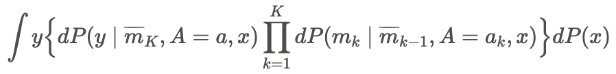

```{r setup, include=FALSE}
library(knitr)
opts_chunk$set(warning = FALSE, message = FALSE, eval= T)
```

This package is built for estimating the causal **path-specific effects** (PSEs) in mediation analysis with multiple ordered mediators for one binary treatments or multiple binary treatments. It provides robust estimators based on influence function theory.

Primary advantages of the package include:

-   **Two decomposition strategies**: This package can return the Natural PSEs and Cumulative PSEs of most common pathways ([Xiang Zhou, 2022](https://academic.oup.com/jrsssb/article/84/3/794/7056148)).

-   **Flexible pathways**: User can calculate the average potential outcome for any identified paths, as well as the average causal effect by comparing the average potential outcome.

-   **flexible model fitting**: he package supports model fitting using `glm/lm`, `twopart`, `bart` from dbarts, `Superlearner` now. Users can also integrate new models for estimation by modifying the `fl_model_template`.

-   **flexible estimators**: Three estimator approaches are available—Inverse Probability Weighting (IPW), plug-in G-computation, and Efficient Influence Function (EIF). The EIF-based estimator is particularly robust against model misspecification, ensuring reliable results.

Detailed instructions for using the package are provided below.

# 0. Installation:

```{r, eval=FALSE}
install.packages("devtools")
library(devtools)

install_github("xxou/flexPaths")
library(flexPaths)
```

```{r, eval=T,echo=FALSE}
library(flexPaths)
```


# 1. PSEs for Single Treatment

Here, we illustrate the case with two mediators $M_1$ and $M_2$ (the mediator can be high demensional). Let $A$ denote the binary treatment (0 or 1), $Y$ denote the outcome, and $X$ denote the covariates.

{width="400"}

Denote the counterfactual outcome $\phi(a_1, a_2, a) = Y(a,M_1(a_1),M_2(a_2,M_1(a_1)))$ that would be observed if $A$ were set to $a$ and $M_1$ and $M_2$ were set to the natural value they would have taken if $A$ had been $a_1$ and $a_2$, where $(a_1, a_2, a) \in \{0,1\}^3$. For example, $\phi(0, 1, 1)$ means what the outcome would be when individuals were treated $A=1$ and their $M_1$ was set at its natural level as individuals without treated $A=0$. Besides, $Y(a)$ represents $\phi(a, a, a)$, where individuals take its natural values for all mediators.

**Decomposition**:

The effect of specific pathway can be defined as a contrast against $Y(0)$ on a mean scale, and these effects are also called natural path-specific effect:

- $\rho_{A \rightarrow M_1 \leadsto Y} = \mathbb{E} (\phi(1,0,0)) - \mathbb{E} (\phi(0,0,0))$
- $\rho_{A \rightarrow M_2 \rightarrow Y} = \mathbb{E} (\phi(0,1,0)) - \mathbb{E} (\phi(0,0,0))$
- $\rho_{A \rightarrow Y} = \mathbb{E} (\phi(0,0,1)) - \mathbb{E} (\phi(0,0,0))$

Another way to represent PSEs is to decompose the total effect sequentially, and these effects are called cumulative path-specific effect: $\mathbb{E}(Y(1)) -  \mathbb{E}(Y(1)) =\rho_{A \rightarrow M_1 \leadsto Y}  + \rho_{A \rightarrow M_2 \rightarrow Y} + \rho_{A \rightarrow Y}$

- $\rho_{A \rightarrow M_1 \leadsto Y} = \mathbb{E} (\phi(1,1,1)) - \mathbb{E} (\phi(0,1,1))$
- $\rho_{A \rightarrow M_2 \rightarrow Y} = \mathbb{E} (\phi(0,1,1)) - \mathbb{E} (\phi(0,0,1))$
- $\rho_{A \rightarrow Y} = \mathbb{E} (\phi(0,0,1)) - \mathbb{E} (\phi(0,0,0))$

In the absence of interactions between $A$ and $M$, natural PSEs and cumulative PSEs yield identical results. However, when interactions are present, they display different results except the same direct effect. Meanwhile, natural PSEs cannot be simply summed to represent the total effect. Therefore, these proportions are not analogous to the ``proportion mediated'' typically.


**Identified pathways**:

{width="1067"}


Considering the assumptions of identification, only three pathways above can be identified in our example. $\rho_{A \rightarrow M_1 \leadsto Y}$ captures the effects of all directed pathways from $A$ to $Y$ through $M_1$, i.e., $A \rightarrow M_1 \rightarrow Y$ and $A \rightarrow M_1 \rightarrow M_2 \rightarrow Y$. $\rho_{A \rightarrow M_2 \rightarrow Y}$ captures the effects of all directed pathways from $A$ to $Y$ through $M_2$. $\rho_{A \rightarrow Y}$ captures the direct effect of $A$ on $Y$. For $K$ ordered mediators, only $K+1$ pathways can be identified which are $A \rightarrow Y$ and $A \rightarrow M_k \leadsto Y$ ($k \in \{1, \ldots,K\}$). $\rho_{A \rightarrow M_k \leadsto Y}$ captures all the effect through $M_k$. The identification formula of $\mathbb{E}(\phi(a_1, \ldots,a_K, a))$ is 

{width="500"}


**Models for Estimation**:

- For IPW approach: To estimate $K+1$ PSEs, we need to fit $K+1$ models to estimate propensity score $P(A|X), P(A|X,M_1), \ldots, P(A|X,M_1,\ldots,M_K)$.
- For plug-in G computation: To estimate $K+1$ PSEs, we need to fit $K+1$ models for outcome regression $\mathbb{E}(Y|X), \mathbb{E}(Y|X,M_1), \ldots, \mathbb{E}(Y|X,M_1,\ldots,M_K)$.
- For EIF approach: To estimate $K+1$ PSEs, we need to fit $K+1$ models to estimate both propensity score $P(A|X), P(A|X,M_1), \ldots, P(A|X,M_1,\ldots,M_K)$ and $K+1$ outcome regression $\mathbb{E}(Y|X), \mathbb{E}(Y|X,M_1), \ldots, \mathbb{E}(Y|X,M_1,\ldots,M_K)$.

## 1.1 `pathsFit`: input needed information for PSEs calculation

We provide data `singTreat` for one treatment with 3 ordered mediators, following the sequence : $ A  \rightarrow M_1  \rightarrow M_2 \rightarrow M_3 \rightarrow Y$

- A: treat
- M_1: med1
- M_2: med2_1 and med2_2
- M_3: med3
- Y: outcome1 is continuous and outcome2 is binary
```{r}
data("singTreat")
head(singTreat)
```


The `pathsFit` function takes the necessary input information and verifies whether the inputs meet the specified requirements.
**detailed introduction about model setting is to be added**


```{r}
EIF_fit <- pathsFit(data = singTreat, A = "treat", Y = "outcome1", cov_x = c("X1", "X2"),
                    M.list = list(M1 = "med1", M2 = c('med2_1', 'med2_2'), M3 = 'med3'),
                    estimation = "EIF",
                    model.outcome = list(~ glm(family = gaussian())),
                    model.propensity = ~ bart(verbose = FALSE, ndpost = 200)
)
```

## 1.2 `pathsEffect`: PSEs through each mediator

```{r}
EIF_fit <- pathsFit(data = singTreat, A = "treat", Y = "outcome1", cov_x = c("X1", "X2"),
                    M.list = list(M1 = "med1", M2 = c('med2_1', 'med2_2'), M3 = 'med3'),
                    estimation = "EIF",
                    model.outcome = ~ glm(family = gaussian()),
                    model.propensity = ~ glm(family = binomial())
)
```

`pathsEffect` function returns the effects through each mediator. Users need to provide the `pathsFit` and select a decomposition method to obtain the PSEs. In the presence of interactions, the results from the two decomposition methods will not align, except for the total and direct effects.
```{r}
results_refer0 <- pathsEffect(pathsFit = EIF_fit, decomposition = "refer0", scale = "diff", CI_level = 0.95)
results_refer0
```

```{r}
results_seq <- pathsEffect(pathsFit = EIF_fit, decomposition = "sequential", scale = "diff", CI_level = 0.95)
results_seq
```


The standard error and confidence intervals can also be estimated using the bootstrap method. Set `nboot` to specify the number of bootstrap iterations, and if `m.cores` is set to a positive integer, parallel computation will be utilized.
```{r}
results_boot <- pathsEffect( pathsFit = EIF_fit, decomposition = "sequential", scale = "diff", CI_level = 0.95, nboot = 10, m.cores = NULL)

results_boot <- pathsEffect( pathsFit = EIF_fit, decomposition = "sequential", scale = "diff", CI_level = 0.95, nboot = 10, m.cores = 3)
results_boot
```

## 1.3 `flexEffect`: PSE for flexible combined paths

The `flexEffect` function can get effect for any identified path or combined path by comparing two potential outcome form the function `flexPotential`.

The `flexPotential` will calculate the **potential outcome** for user-specified counterfactual values. For example, potential_outcome0 returns the potential outcome for individuals in treatment = 0 whose mediators were set as they had not received treatment.  The argument active = $c(a_1, a_2, a_3, a)$ specifies the counterfatual value of $A$ for $M_1$, $M_2$, $M_3$ and $Y$ orderly.
```{r}
potential_outcome0 <- flexPotential(pathsFit = EIF_fit, active = c(0, 0, 0, 0))
potential_outcome1 <- flexPotential(pathsFit = EIF_fit, active = c(1, 0, 1, 1))
potential_outcome2 <- flexPotential(pathsFit = EIF_fit, active = c(1, 0, 0, 1))
potential_outcome3 <- flexPotential(pathsFit = EIF_fit, active = c(1, 0, 0, 0))
```


After obtaining the potential outcomes from  `flexPotential`, we can use the `flexEffect` to calculate the effects by comparing p1 and p2. For example, flex_results1 represents the PSEs: $\E(\phi(1,0,1,1)) - \E(\phi(0, 0, 0, 0))$ which captures the effect mediated through $M_1$, $M_3$ and direct effect $A \rightarrow Y$:
```{r}
flex_results1 <- flexEffect(p1 = potential_outcome1,
                            p0 = potential_outcome0, scale = "diff", CI_level = 0.95,nboot = 10, m.cores = 3)
flex_results1
```

To simplify multiple comparisons, p1 and p2 can be provided as lists. Note the following:

1. When p1 and p2 have the same length,  `flexEffect` will compare each element of p1 with the corresponding element of p0. For instance, it will compare potential_outcome1 with potential_outcome0, and potential_outcome2 with potential_outcome3 here.

```{r}
flex_results <- flexEffect(p1 = list(potential_outcome1, potential_outcome2),
                           p0 = list(potential_outcome0, potential_outcome3), scale = "diff", CI_level = 0.95,nboot = 5)
flex_results
```

2. When either p1 or p2 contains a single input and the other is a list, flexEffect will compare that single element with each element in the list. For example, it will compare potential_outcome1 with potential_outcome0, and potential_outcome2 with potential_outcome0.
```{r}
flex_results <- flexEffect(p1 = list(potential_outcome1, potential_outcome2),
                           p0 = potential_outcome0, scale = "diff", CI_level = 0.95,nboot = 5)
flex_results
```

Similarly, this approach allows for the comparison of potential_outcome1 versus potential_outcome2, and potential_outcome1 versus potential_outcome3.

```{r}
flex_results <- flexEffect(p1 = list(potential_outcome1),
                           p0 = list(potential_outcome2,potential_outcome3), scale = "diff", CI_level = 0.95,nboot = 5)
flex_results
```

# 2. PSEs for Multiple Treatments

Similarly, we illustrate the example of two treatments with three mediators (the mediator can be high demensional). Let $A_1$ and $A_2$ denote binary treatments (0 or 1), $Y$ denote the outcome, and $X$ denote the covariates.

{width="400"}

The sequence of treatments and mediators follows the order:  $A \rightarrow M_1 \rightarrow A_2 \rightarrow M_2  \rightarrow Y$.  

Denote the counterfactual outcome $\phi(a_{11}, a_{12}, a_{10}, a_{22}, a_{20} ) = Y(a_{10}, a_{20},M_1(a_{11}),M_2(a_{12}, a_{22},M_1(a_{11})))$, where $a_{ij}$ represents the counterfactual value of treatment $i$ for mediator $j$ ($j = 0$ represents outcome $Y$). Notably, since $M_1$ occurs before $A_2$, thus there is no counterfactual value of $A_2$ for $M_1$, and thus $a_{21}$ is $NA$. Taking the direct effect of treatment $A_1$ and treatment $A_2$ as an example, $\phi(a_{11}=0, a_{12}=0, a_{10}=1, a_{22}=0, a_{20}=1 )$ means what the outcome would be when individuals were treated with both $A_1=1$ and $A_2=1$ and the mediator $M_1$ was set at its natural level for those without treatment 1 ($A_1=0$), as well as mediator $M_2$ was set at its natural level for those without both treatments 1 ($A_1=0$) and treatment 2 $A_2=0$). 

This can be represented in matrix form, where rows represent treatments and columns represent mediators:

{width="280"}

**Models for Estimation**:
Given the complexity of models involving multiple treatments, this package applies a consistent modeling technique across all propensity models and another across all outcome regression models.

- IPW Approach: Users must select a single modeling technique to fit all propensity models.
- Plug-in G Computation: Users must choose one modeling technique to fit all outcome regression models.
- EIF Approach: Users must select one modeling technique for all propensity models and a separate technique for all outcome regression models.


## 2.1 `pathsFit`


We provide data `multiTreat` for 3 treatments with 6 ordered mediators, following the sequence: $A_1 \rightarrow A_2 \rightarrow M_1 \rightarrow M_2 \rightarrow M_3 \rightarrow A_3 \rightarrow M_4 \rightarrow M_5 \rightarrow M_6 \rightarrow Y$.

- A: t1, t2, t3
- M_1: m1
- M_2: m2
- M_3: m3
- M_4: m4
- M_5: m5
- M_6: m6
- Y: continuous Y

```{r}
data("multiTreat")
head(multiTreat)
```

```{r}
mfit<- pathsFit(data = multiTreat,
                Y = "Y",
                A = c("t1","t2","t3"),
                cov_x = "X",
                M.list = list(
                  M1 = 'm1',
                  M2 = 'm2',
                  M3 = 'm3',
                  M4 = 'm4',
                  M5 = 'm5',
                  M6 = 'm6'
                ),
                estimation = "EIF",
                model.propensity =list( ~  glm(family = binomial())),
                model.outcome = list( ~SuperLearner(SL.library = "SL.mean",family = gaussian())),
                model.iter  = list(~glm(family = gaussian()))
)
```

## 2.2 `mpathEffect`


## 2.3 `mflexEffect`
The length of the active list corresponds to the number of treatments. In active1 example, each vector in $a_1, a_2, a_3$ represents values assigned to $M_1, M_2, ..., M_6$ and $Y$. The first three values are NAs, indicating that the $a_3$ is between $M_3$ and $M_4$. The longest path in this scenario is $A_1 \rightarrow A_2 \rightarrow M_1 \rightarrow M_2 \rightarrow M_3 \rightarrow A_3 \rightarrow M_4 \rightarrow M_5 \rightarrow M_6 \rightarrow Y$.

For active2, the longest path is $A_1 \rightarrow M_1 \rightarrow M_2 \rightarrow A_2 \rightarrow M_3 \rightarrow M_4 \rightarrow A_3 \rightarrow M_5 \rightarrow M_6 \rightarrow Y$.

```{r}
active1 = list(a1=c(0,1,0,0,1,0,0),
               a2=c(1,0,1,1,1,0,0),
               a3=c(NA,NA,NA,1,0,0,0))


active2 = list(a1=c(0,1,0,0,1,0,0),
               a2=c(NA,NA,1,1,1,0,0),
               a3=c(NA,NA,NA,NA,0,0,0))
```

Potential outcome for active1 setting.

```{r}
mp1<-mflexPotential(active = list(a1=c(0,1,0,0,1,0,0),
                                  a2=c(1,0,1,1,1,0,0),
                                  a3=c(NA,NA,NA,1,0,0,0)),mfit)
mp2<-mflexPotential(active = list(a1=c(0,0,0,0,1,0,0),
                                  a2=c(0,0,0,1,1,0,0),
                                  a3=c(NA,NA,NA,1,0,0,0)),mfit)

```

The same setting as single treatment.
```{r}
flexEffect(p1 = mp1, p0 = mp2, scale = "diff", CI_level = 0.95, nboot =2 , m.cores = 8)
```
