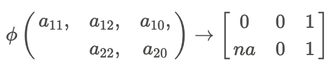

flexPaths: A R Package for Causal Path-Specific Effect Estimation with
Flexible Settings
================
Xiaxian Ou
2024-09-24

- [0. Installation:](#0-installation)
- [1. PSEs for Single Treatment](#1-pses-for-single-treatment)
  - [1.1 `pathsFit`: input needed information for PSEs
    calculation](#11-pathsfit-input-needed-information-for-pses-calculation)
  - [1.2 `pathsEffect`: PSEs through each
    mediator](#12-pathseffect-pses-through-each-mediator)
  - [1.3 `flexEffect`: PSE for flexible
    pathway(s)](#13-flexeffect-pse-for-flexible-pathways)
- [2. PSEs for Multiple Treatments](#2-pses-for-multiple-treatments)
  - [2.1 `pathsFit`: input needed information for PSEs
    calculation](#21-pathsfit-input-needed-information-for-pses-calculation)
  - [2.2 `flexEffect`: PSE for flexible
    pathway(s)](#22-flexeffect-pse-for-flexible-pathways)

This package is built for estimating the causal **path-specific
effects** (PSEs) in mediation analysis with multiple ordered mediators
for one binary treatments or multiple binary treatments. It provides
robust estimators based on influence function theory.

Primary advantages of the package include:

- **Two decomposition strategies**: This package can return the Natural
  PSEs and Cumulative PSEs of most common pathways ([Xiang Zhou,
  2022](https://academic.oup.com/jrsssb/article/84/3/794/7056148)).

- **Flexible pathways**: User can calculate the average potential
  outcome for any identified paths, as well as the average causal effect
  by comparing the average potential outcome.

- **flexible model fitting**: he package supports model fitting using
  `glm/lm`, `twopart`, `bart` from dbarts, `Superlearner` now. Users can
  also integrate new models for estimation by modifying the
  `fl_model_template`.

- **flexible estimators**: Three estimator approaches are
  available—Inverse Probability Weighting (IPW), plug-in G-computation,
  and Efficient Influence Function (EIF). The EIF-based estimator is
  particularly robust against model misspecification, ensuring reliable
  results.

Detailed instructions for using the package are provided below.

# 0. Installation:

``` r
install.packages("devtools")
library(devtools)

install_github("xxou/flexPaths")
library(flexPaths)
```

# 1. PSEs for Single Treatment

Here, we illustrate the case with two mediators $M_1$ and $M_2$ (the
mediator can be high demensional). Let $A$ denote the binary treatment
(0 or 1), $Y$ denote the outcome, and $X$ denote the covariates.


Denote the counterfactual outcome
$\phi(a_1, a_2, a) = Y(a,M_1(a_1),M_2(a_2,M_1(a_1)))$ that would be
observed if $A$ were set to $a$ and $M_1$ and $M_2$ were set to the
natural value they would have taken if $A$ had been $a_1$ and $a_2$,
where $(a_1, a_2, a) \in \{0,1\}^3$. For example, $\phi(0, 1, 1)$ means
what the outcome would be when individuals were treated $A=1$ and their
$M_1$ was set at its natural level as individuals without treated $A=0$.
Besides, $Y(a)$ represents $\phi(a, a, a)$, where individuals take its
natural values for all mediators.

**Decomposition**:

The effect of specific pathway can be defined as a contrast against
$Y(0)$ on a mean scale, and these effects are also called natural
path-specific effect:

- $\rho_{A \rightarrow M_1 \leadsto Y} = \mathbb{E} (\phi(1,0,0)) - \mathbb{E} (\phi(0,0,0))$
- $\rho_{A \rightarrow M_2 \rightarrow Y} = \mathbb{E} (\phi(0,1,0)) - \mathbb{E} (\phi(0,0,0))$
- $\rho_{A \rightarrow Y} = \mathbb{E} (\phi(0,0,1)) - \mathbb{E} (\phi(0,0,0))$

Another way to represent PSEs is to decompose the total effect
sequentially, and these effects are called cumulative path-specific
effect:
$\mathbb{E}(Y(1)) -  \mathbb{E}(Y(1)) =\rho_{A \rightarrow M_1 \leadsto Y}  + \rho_{A \rightarrow M_2 \rightarrow Y} + \rho_{A \rightarrow Y}$

- $\rho_{A \rightarrow M_1 \leadsto Y} = \mathbb{E} (\phi(1,1,1)) - \mathbb{E} (\phi(0,1,1))$
- $\rho_{A \rightarrow M_2 \rightarrow Y} = \mathbb{E} (\phi(0,1,1)) - \mathbb{E} (\phi(0,0,1))$
- $\rho_{A \rightarrow Y} = \mathbb{E} (\phi(0,0,1)) - \mathbb{E} (\phi(0,0,0))$

In the absence of interactions between $A$ and $M$, natural PSEs and
cumulative PSEs yield identical results. However, when interactions are
present, they display different results except the same direct effect.
Meanwhile, natural PSEs cannot be simply summed to represent the total
effect. Therefore, these proportions are not analogous to the
\`\`proportion mediated’’ typically.

**Identified pathways**:


Considering the assumptions of identification, only three pathways above
can be identified in our example. $\rho_{A \rightarrow M_1 \leadsto Y}$
captures the effects of all directed pathways from $A$ to $Y$ through
$M_1$, i.e., $A \rightarrow M_1 \rightarrow Y$ and
$A \rightarrow M_1 \rightarrow M_2 \rightarrow Y$.
$\rho_{A \rightarrow M_2 \rightarrow Y}$ captures the effects of all
directed pathways from $A$ to $Y$ through $M_2$.
$\rho_{A \rightarrow Y}$ captures the direct effect of $A$ on $Y$. For
$K$ ordered mediators, only $K+1$ pathways can be identified which are
$A \rightarrow Y$ and $A \rightarrow M_k \leadsto Y$
($k \in \{1, \ldots,K\}$). $\rho_{A \rightarrow M_k \leadsto Y}$
captures all the effect through $M_k$. The identification formula of
$\mathbb{E}(\phi(a_1, \ldots,a_K, a))$ is


**Models for Estimation**:

- For IPW approach: To estimate $K+1$ PSEs, we need to fit $K+1$ models
  to estimate propensity score
  $P(A|X), P(A|X,M_1), \ldots, P(A|X,M_1,\ldots,M_K)$.
- For plug-in G computation: To estimate $K+1$ PSEs, we need to fit
  $K+1$ models for outcome regression
  $\mathbb{E}(Y|X), \mathbb{E}(Y|X,M_1), \ldots, \mathbb{E}(Y|X,M_1,\ldots,M_K)$.
- For EIF approach: To estimate $K+1$ PSEs, we need to fit $K+1$ models
  to estimate both propensity score
  $P(A|X), P(A|X,M_1), \ldots, P(A|X,M_1,\ldots,M_K)$ and $K+1$ outcome
  regression
  $\mathbb{E}(Y|X), \mathbb{E}(Y|X,M_1), \ldots, \mathbb{E}(Y|X,M_1,\ldots,M_K)$.

## 1.1 `pathsFit`: input needed information for PSEs calculation

We provide data `singTreat` for one treatment with 3 ordered mediators,
following the sequence :
$A  \rightarrow M_1  \rightarrow M_2 \rightarrow M_3 \rightarrow Y$

- A: treat
- $M_1$: med1
- $M_2$: med2_1 and med2_2
- $M_3$: med3
- Y: outcome1 is continuous and outcome2 is binary

``` r
data("singTreat")
head(singTreat)
```

    ##   treat          X1          X2       med1     med2_1     med2_2        med3
    ## 1     1 -0.56047565 -0.99579872 -0.2909027  1.4214143  0.9080483 -0.48342238
    ## 2     0 -0.23017749 -1.03995504  0.5282772 -1.6131178 -0.6618017 -1.85925365
    ## 3     1  1.55870831 -0.01798024  0.1072271 -1.5679208  2.0982984 -0.53101464
    ## 4     0  0.07050839 -0.13217513 -0.5198824 -0.4209952 -1.0630016  0.46861537
    ## 5     1  0.12928774 -2.54934277  1.3002422  0.2256734  1.3468199  0.01871409
    ## 6     1  1.71506499  1.04057346  0.3673916  0.5568637  2.1457944  2.10776412
    ##     outcome1 outcome2
    ## 1  1.3885202        1
    ## 2 -0.7139441        1
    ## 3  1.8068598        0
    ## 4  1.0421935        1
    ## 5 -0.3632091        1
    ## 6  2.1553060        1

The `pathsFit` function takes the necessary input information and
verifies whether the inputs meet the specified requirements. **detailed
introduction about model setting is to be added**

``` r
EIF_fit <- pathsFit(data = singTreat, A = "treat", Y = "outcome1", cov_x = c("X1", "X2"),
                    M.list = list(M1 = "med1", M2 = c('med2_1', 'med2_2'), M3 = 'med3'),
                    estimation = "EIF",
                    model.outcome = list(~ glm(family = gaussian())),
                    model.propensity = ~ bart(verbose = FALSE, ndpost = 200)
)
```

    ##  Input checks passed successfully.

## 1.2 `pathsEffect`: PSEs through each mediator

``` r
EIF_fit <- pathsFit(data = singTreat, A = "treat", Y = "outcome1", cov_x = c("X1", "X2"),
                    M.list = list(M1 = "med1", M2 = c('med2_1', 'med2_2'), M3 = 'med3'),
                    estimation = "EIF",
                    model.outcome = ~ glm(family = gaussian()),
                    model.propensity = ~ glm(family = binomial())
)
```

    ##  Input checks passed successfully.

`pathsEffect` function returns the effects through each mediator. Users
need to provide the `pathsFit` and select a decomposition method to
obtain the PSEs. In the presence of interactions, the results from the
two decomposition methods will not align, except for the total and
direct effects.

``` r
results_refer0 <- pathsEffect(pathsFit = EIF_fit, decomposition = "refer0", scale = "diff", CI_level = 0.95)
results_refer0
```

    ## 
    ## Causal Paths Analysis: 0 reference decomposition ; scale: diff ; estimation: EIF
    ## 
    ## Call: pathsEffect(pathsFit = EIF_fit, decomposition = "refer0", scale = "diff", 
    ##     CI_level = 0.95)
    ## 
    ## 
    ## Causal Paths Estimates: 
    ## 
    ##                      Path      Effect         SE    CI.lower   CI.upper P.value
    ## 1           A->M1->...->Y 0.188162979 0.03165008  0.12612996 0.25019600  0.0000
    ## 2           A->M2->...->Y 0.069235296 0.02627361  0.01773997 0.12073062  0.0084
    ## 3           A->M3->...->Y 0.007333175 0.01016017 -0.01258040 0.02724675  0.4704
    ## 4                    A->Y 0.513165676 0.06549502  0.38479779 0.64153356  0.0000
    ## 5 total effect: A->...->Y 0.749385989 0.06955366  0.61306333 0.88570865  0.0000

``` r
results_seq <- pathsEffect(pathsFit = EIF_fit, decomposition = "sequential", scale = "diff", CI_level = 0.95)
results_seq
```

    ## 
    ## Causal Paths Analysis: sequential decomposition ; scale: diff ; estimation: EIF
    ## 
    ## Call: pathsEffect(pathsFit = EIF_fit, decomposition = "sequential", 
    ##     scale = "diff", CI_level = 0.95)
    ## 
    ## 
    ## Causal Paths Estimates: 
    ## 
    ##                      Path       Effect         SE    CI.lower   CI.upper
    ## 1           A->M1->...->Y  0.159502029 0.03112555  0.09849708 0.22050698
    ## 2           A->M2->...->Y  0.080741578 0.02125415  0.03908421 0.12239895
    ## 3           A->M3->...->Y -0.004023294 0.01008338 -0.02378635 0.01573976
    ## 4                    A->Y  0.513165676 0.06549502  0.38479779 0.64153356
    ## 5 total effect: A->...->Y  0.749385989 0.06955366  0.61306333 0.88570865
    ##   P.value
    ## 1  0.0000
    ## 2  0.0001
    ## 3  0.6899
    ## 4  0.0000
    ## 5  0.0000

The standard error and confidence intervals can also be estimated using
the bootstrap method. Set `nboot` to specify the number of bootstrap
iterations, and if `m.cores` is set to a positive integer, parallel
computation will be utilized.

``` r
results_boot <- pathsEffect( pathsFit = EIF_fit, decomposition = "sequential", scale = "diff", CI_level = 0.95, nboot = 10, m.cores = NULL)

results_boot <- pathsEffect( pathsFit = EIF_fit, decomposition = "sequential", scale = "diff", CI_level = 0.95, nboot = 10, m.cores = 3)
results_boot
```

    ## 
    ## Causal Paths Analysis: sequential decomposition ; scale: diff ; estimation: EIF
    ## 
    ## Call: pathsEffect(pathsFit = EIF_fit, decomposition = "sequential", 
    ##     scale = "diff", CI_level = 0.95, nboot = 10, m.cores = 3)
    ## 
    ## 
    ## boot strap results: 
    ## 
    ##                      Path       Effect     boot.SE boot.CI.lower boot.CI.upper
    ## 1           A->M1->...->Y  0.159502029 0.023184560    0.10539743     0.1697868
    ## 2           A->M2->...->Y  0.080741578 0.010759812    0.07545817     0.1040069
    ## 3           A->M3->...->Y -0.004023294 0.005427812   -0.01205165     0.0028993
    ## 4                    A->Y  0.513165676 0.047894231    0.42125790     0.5742911
    ## 5 total effect: A->...->Y  0.749385989 0.046835229    0.64730404     0.7961643
    ##   boot.P.value nboot
    ## 1       0.0000    10
    ## 2       0.0000    10
    ## 3       0.4585    10
    ## 4       0.0000    10
    ## 5       0.0000    10

## 1.3 `flexEffect`: PSE for flexible pathway(s)

The `flexEffect` function can get effect for any identified path or
combined path by comparing two potential outcome form the function
`flexPotential`.

The `flexPotential` will calculate the **potential outcome** for
user-specified counterfactual values. For example, potential_outcome0
returns the potential outcome for individuals in treatment = 0 whose
mediators were set as they had not received treatment. The argument
active = $c(a_1, a_2, a_3, a)$ specifies the counterfatual value of $A$
for $M_1$, $M_2$, $M_3$ and $Y$ orderly.

``` r
potential_outcome0 <- flexPotential(pathsFit = EIF_fit, active = c(0, 0, 0, 0))
potential_outcome1 <- flexPotential(pathsFit = EIF_fit, active = c(1, 0, 1, 1))
potential_outcome2 <- flexPotential(pathsFit = EIF_fit, active = c(1, 0, 0, 1))
potential_outcome3 <- flexPotential(pathsFit = EIF_fit, active = c(1, 0, 0, 0))
```

After obtaining the potential outcomes from `flexPotential`, we can use
the `flexEffect` to calculate the effects by comparing p1 and p2. For
example, flex_results1 represents the PSEs:
$\mathbb{E}(\phi(1,0,1,1)) - \mathbb{E}(\phi(0, 0, 0, 0))$ which
captures the effect mediated through $M_1$, $M_3$ and direct effect
$A \rightarrow Y$:

``` r
flex_results1 <- flexEffect(p1 = potential_outcome1,
                            p0 = potential_outcome0, scale = "diff", CI_level = 0.95,nboot = 10, m.cores = 3)
flex_results1
```

    ## 
    ## Flexible Paths Analysis 
    ## 
    ## Call: flexEffect(p1 = potential_outcome1, p0 = potential_outcome0, 
    ##     scale = "diff", CI_level = 0.95, nboot = 10, m.cores = 3)
    ## 
    ## 
    ## boot strap results: 
    ## 
    ##         active   Effect    boot.SE boot.CI.lower boot.CI.upper boot.P.value
    ## 1 1011 vs 0000 0.674418 0.05958431     0.5904757     0.7770134            0
    ##   nboot
    ## 1    10

To simplify multiple comparisons, p1 and p2 can be provided as lists.
Note the following:

1.  When p1 and p2 have the same length, `flexEffect` will compare each
    element of p1 with the corresponding element of p0. For instance, it
    will compare potential_outcome1 with potential_outcome0, and
    potential_outcome2 with potential_outcome3 here.

``` r
flex_results <- flexEffect(p1 = list(potential_outcome1, potential_outcome2),
                           p0 = list(potential_outcome0, potential_outcome3), scale = "diff", CI_level = 0.95,nboot = 5)
flex_results
```

    ## 
    ## Flexible Paths Analysis 
    ## 
    ## Call: flexEffect(p1 = list(potential_outcome1, potential_outcome2), 
    ##     p0 = list(potential_outcome0, potential_outcome3), scale = "diff", 
    ##     CI_level = 0.95, nboot = 5)
    ## 
    ## 
    ## boot strap results: 
    ## 
    ##         active    Effect    boot.SE boot.CI.lower boot.CI.upper boot.P.value
    ## 1 1001 vs 1000 0.4894581 0.06442672     0.4031085     0.5612199            0
    ## 2 1011 vs 0000 0.6744180 0.07747431     0.5745700     0.7695518            0
    ##   nboot
    ## 1     5
    ## 2     5

2.  When either p1 or p2 contains a single input and the other is a
    list, flexEffect will compare that single element with each element
    in the list. For example, it will compare potential_outcome1 with
    potential_outcome0, and potential_outcome2 with potential_outcome0.

``` r
flex_results <- flexEffect(p1 = list(potential_outcome1, potential_outcome2),
                           p0 = potential_outcome0, scale = "diff", CI_level = 0.95,nboot = 5)
flex_results
```

    ## 
    ## Flexible Paths Analysis 
    ## 
    ## Call: flexEffect(p1 = list(potential_outcome1, potential_outcome2), 
    ##     p0 = potential_outcome0, scale = "diff", CI_level = 0.95, 
    ##     nboot = 5)
    ## 
    ## 
    ## boot strap results: 
    ## 
    ##         active   Effect    boot.SE boot.CI.lower boot.CI.upper boot.P.value
    ## 1 1001 vs 0000 0.677621 0.07604500     0.5506095     0.7412413            0
    ## 2 1011 vs 0000 0.674418 0.08163048     0.5327752     0.7361775            0
    ##   nboot
    ## 1     5
    ## 2     5

Similarly, this approach allows for the comparison of potential_outcome1
versus potential_outcome2, and potential_outcome1 versus
potential_outcome3.

``` r
flex_results <- flexEffect(p1 = list(potential_outcome1),
                           p0 = list(potential_outcome2,potential_outcome3), scale = "diff", CI_level = 0.95,nboot = 5)
flex_results
```

    ## 
    ## Flexible Paths Analysis 
    ## 
    ## Call: flexEffect(p1 = list(potential_outcome1), p0 = list(potential_outcome2, 
    ##     potential_outcome3), scale = "diff", CI_level = 0.95, nboot = 5)
    ## 
    ## 
    ## boot strap results: 
    ## 
    ##         active       Effect    boot.SE boot.CI.lower boot.CI.upper boot.P.value
    ## 1 1011 vs 1000  0.486255031 0.05771213    0.41971947    0.54648521       0.0000
    ## 2 1011 vs 1001 -0.003203024 0.01270263   -0.01639075    0.01093889       0.8009
    ##   nboot
    ## 1     5
    ## 2     5

# 2. PSEs for Multiple Treatments

Similarly, we illustrate the example of two treatments with three
mediators (the mediator can be high demensional). Let $A_1$ and $A_2$
denote binary treatments (0 or 1), $Y$ denote the outcome, and $X$
denote the covariates.


The sequence of treatments and mediators follows the order:
$A \rightarrow M_1 \rightarrow A_2 \rightarrow M_2  \rightarrow Y$.

Denote the counterfactual outcome
$\phi(a_{11}, a_{12}, a_{10}, a_{22}, a_{20} ) = Y(a_{10}, a_{20},M_1(a_{11}),M_2(a_{12}, a_{22},M_1(a_{11})))$,
where $a_{ij}$ represents the counterfactual value of treatment $i$ for
mediator $j$ ($j = 0$ represents outcome $Y$). Notably, since $M_1$
occurs before $A_2$, thus there is no counterfactual value of $A_2$ for
$M_1$, and thus $a_{21}$ is $NA$. Taking the direct effect of treatment
$A_1$ and treatment $A_2$ as an example,
$\phi(a_{11}=0, a_{12}=0, a_{10}=1, a_{22}=0, a_{20}=1 )$ means what the
outcome would be when individuals were treated with both $A_1=1$ and
$A_2=1$ and the mediator $M_1$ was set at its natural level for those
without treatment 1 ($A_1=0$), as well as mediator $M_2$ was set at its
natural level for those without both treatments 1 ($A_1=0$) and
treatment 2 $A_2=0$).

This can be represented in matrix form, where rows represent treatments
and columns represent mediators:



**Models for Estimation**: Given the complexity of models involving
multiple treatments, this package applies a consistent modeling
technique across all propensity models and another across all outcome
regression models.

- IPW Approach: Users must select a single modeling technique to fit all
  propensity models.
- Plug-in G Computation: Users must choose one modeling technique to fit
  all outcome regression models.
- EIF Approach: Users must select one modeling technique for all
  propensity models and a separate technique for all outcome regression
  models.

## 2.1 `pathsFit`: input needed information for PSEs calculation

We provide data `multiTreat` for 3 treatments with 6 ordered mediators,
following the sequence:
$A_1 \rightarrow A_2 \rightarrow M_1 \rightarrow M_2 \rightarrow M_3 \rightarrow A_3 \rightarrow M_4 \rightarrow M_5 \rightarrow M_6 \rightarrow Y$.

- A: t1, t2, t3
- M_1: m1
- M_2: m2
- M_3: m3
- M_4: m4
- M_5: m5
- M_6: m6
- Y: continuous Y

``` r
data("multiTreat")
head(multiTreat)
```

    ##            X t1 t2 t3         m1         m2         m3          m4          m5
    ## 1  0.5110004  1  1  1  1.9973170  0.6401092  0.4582243 -0.27523814 -0.09387742
    ## 2  1.8079928  0  1  0  1.1450254  0.8124416  2.1308472  1.64126511  1.37869655
    ## 3 -1.7026150  0  0  1 -1.1258939  1.1395740  1.2105479  0.40682505  0.67242152
    ## 4  0.2874488  0  0  1  0.1496110  0.2528034 -1.0118998  0.25536960  0.91400475
    ## 5 -0.2691142  0  1  0 -0.4372909 -0.9858409  0.0244613  0.53140872  0.35057702
    ## 6 -0.3795247  0  1  1  0.1966683  0.6989559  1.0743453  0.01092031  1.57590275
    ##            m6          Y
    ## 1 -0.07222626  0.8100211
    ## 2  3.74522822  9.7240020
    ## 3 -0.77182524 -0.7412953
    ## 4  0.73485597  0.9291092
    ## 5 -0.12227943  0.6170001
    ## 6  0.38646757  2.0241894

The `pathsFit` function operates the same way as in the single treatment
case, except when a vector of treatments is provided in A.

``` r
mfit<- pathsFit(data = multiTreat,
                Y = "Y",
                A = c("t1","t2","t3"),
                cov_x = "X",
                M.list = list(
                  M1 = 'm1',
                  M2 = 'm2',
                  M3 = 'm3',
                  M4 = 'm4',
                  M5 = 'm5',
                  M6 = 'm6'
                ),
                estimation = "EIF",
                model.propensity =list( ~  glm(family = binomial())),
                model.outcome = list( ~SuperLearner(SL.library = "SL.mean",family = gaussian())),
                model.iter  = list(~glm(family = gaussian()))
)
```

    ##  Input checks passed successfully.

## 2.2 `flexEffect`: PSE for flexible pathway(s)

It is the same function as the single treatment case. It can also get
effect for any identified path or combined path by comparing two
potential outcome form the function `mflexPotential`.

The `mflexPotential` will calculate the **potential outcome** for
user-specified counterfactual values in the scenario of multiple
treatments. In the example data multiTreat, the sequence of treatments
and mediators is
$A_1 \rightarrow A_2 \rightarrow M_1 \rightarrow M_2 \rightarrow M_3 \rightarrow A_3 \rightarrow M_4 \rightarrow M_5 \rightarrow M_6 \rightarrow Y$.
The counterfactual values matrix can be expressed as:


In the function `mflexPotential`, inputs of counterfactual values are
specified using a list. Within the list `active`, each element is named
according to the corresponding treatment order $a_i$, and should contain
a vector of values for $M_1, \cdots,M_6,Y$. Since treatment 3 is after
$M_3$, the first three values in the `a3` vector are set to **NA**.

``` r
mp1<-mflexPotential(active = list(a1=c(0,1,0,0,1,0,0),
                                  a2=c(1,0,1,1,1,0,0),
                                  a3=c(NA,NA,NA,1,0,0,0)),mfit)
mp2<-mflexPotential(active = list(a1=c(0,0,0,0,1,0,0),
                                  a2=c(0,0,0,1,1,0,0),
                                  a3=c(NA,NA,NA,1,0,0,0)),mfit)
```

We can use the `flexEffect` to calculate the effects by comparing p1 and
p2. The flexible inputs of p1 and p2 are the same as in section 1.3.

``` r
flexEffect(p1 = mp1, p0 = mp2, scale = "diff", CI_level = 0.95, nboot =10 , m.cores = 6)
```

    ## 
    ## Flexible Paths Analysis 
    ## 
    ## Call: flexEffect(p1 = mp1, p0 = mp2, scale = "diff", CI_level = 0.95, 
    ##     nboot = 10, m.cores = 6)
    ## 
    ## 
    ## boot strap results: 
    ## 
    ##                                         active    Effect   boot.SE
    ## 1 0100100;1011100;1000 vs 0000100;0001100;1000 0.2406978 0.3686581
    ##   boot.CI.lower boot.CI.upper boot.P.value nboot
    ## 1     0.1383253      1.221401       0.5138    10
