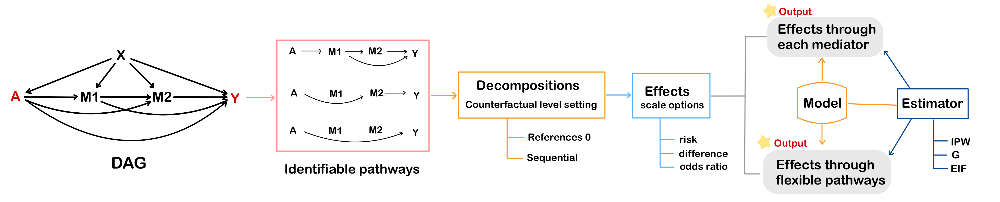
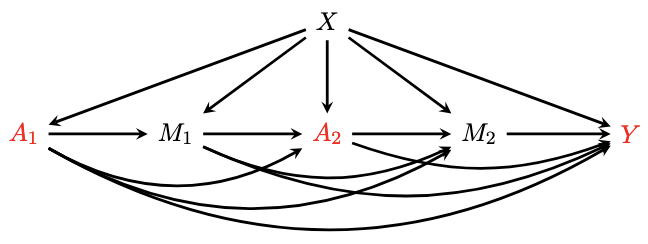

flexPaths: A R Package for Causal Path-Specific Effect Estimation with
Flexible Settings
================
Xiaxian Ou
2024-11-15

- [0. Installation:](#0-installation)
- [1. Quick example: Single
  Treatment](#1-quick-example-single-treatment)
  - [1.1 `pathsEffect`: PSEs through each
    mediator](#11-pathseffect-pses-through-each-mediator)
  - [1.2 `flexEffect`: PSE for flexible
    pathway(s)](#12-flexeffect-pse-for-flexible-pathways)
- [2. Quick example: Multiple
  Treatments](#2-quick-example-multiple-treatments)
  - [2.1 `flexEffect`: PSE for flexible
    pathway(s)](#21-flexeffect-pse-for-flexible-pathways)
- [3. Further instructions for flexible
  models](#3-further-instructions-for-flexible-models)
  - [3.1 Examples for model
    specification](#31-examples-for-model-specification)
  - [3.2 Summary for models and the required
    arguments](#32-summary-for-models-and-the-required-arguments)

This package is built for estimating the causal **path-specific
effects** (PSEs) in mediation analysis with
<span style="color:red">multiple ordered mediators for one binary
treatment or multiple binary treatments</span>. It provides robust
estimators based on influence function theory. This is a schematic
illustration of the flexPaths workflow:



Primary advantages of the package include:

- **Flexible model size**: The number of treatment(s) and mediator(s) is
  flexible.

- **Flexible decomposition**: This package can return the Natural PSEs
  and Cumulative PSEs via each mediator ([Xiang Zhou,
  2022](https://academic.oup.com/jrsssb/article/84/3/794/7056148)).

- **Flexible pathways**: User can calculate the average potential
  outcome for any identified pathway(s), as well as the average causal
  effect by comparing two potential outcome.

- **Flexible models**: The package supports model fitting using
  `glm/lm`, `glmer/lmer` in package `lme4`, `bart` in package `dbarts`,
  `SuperLearner` in package `SuperLearner` now. Users can also integrate
  new models for estimation by modifying the `fl_model_template.R`.

- **Flexible estimators**: This package includes three
  estimators—Inverse Probability Weighting (IPW), plug-in G-computation,
  and Efficient Influence Function (EIF). The EIF estimator enhances
  robustness against model misspecification, ensuring more reliable
  results.

Quick instructions are provided below. For more details, see the html.

# 0. Installation:

``` r
install.packages("devtools")

devtools::install_github("xxou/flexPaths")
library(flexPaths)
```

# 1. Quick example: Single Treatment

Here, we illustrate the case with two mediators $M_1$ and $M_2$ (the
mediator can be high dimensional). Let $A$ denote the binary treatment
(0 or 1), $Y$ denote the outcome, and $X$ denote the covariates.


Denote the counterfactual outcome
$\phi(a_1, a_2, a) = Y(a,M_1(a_1),M_2(a_2,M_1(a_1)))$ that would be
observed if $A$ were set to $a$ and $M_1$ and $M_2$ were set to the
natural value they would have taken if $A$ had been $a_1$ and $a_2$,
where $(a_1, a_2, a) \in \{0,1\}^3$.

**Identified pathways**:

In the case of two mediators, we have three identified pathways. Using
`pathsEffect`, we can obtain the effect via each mediator.


**Decomposition**:

`decomposition = "refer0"`: The effect of specific pathway can be
defined as a contrast against $Y(0)$ on a mean scale, and these effects
are also called natural path-specific effect:

- $\rho_{A \rightarrow M_1 \leadsto Y} = \mathbb{E} (\phi(1,0,0)) - \mathbb{E} (\phi(0,0,0))$
- $\rho_{A \rightarrow M_2 \rightarrow Y} = \mathbb{E} (\phi(0,1,0)) - \mathbb{E} (\phi(0,0,0))$
- $\rho_{A \rightarrow Y} = \mathbb{E} (\phi(0,0,1)) - \mathbb{E} (\phi(0,0,0))$

`decomposition = "sequential"`: Decompose the total effect into PSEs
sequentially, and these effects are also called cumulative path-specific
effect:
$\mathbb{E}(Y(1)) - \mathbb{E}(Y(1)) =\rho_{A \rightarrow M_1 \leadsto Y} + \rho_{A \rightarrow M_2 \rightarrow Y} + \rho_{A \rightarrow Y}$

- $\rho_{A \rightarrow M_1 \leadsto Y} = \mathbb{E} (\phi(1,1,1)) - \mathbb{E} (\phi(0,1,1))$
- $\rho_{A \rightarrow M_2 \rightarrow Y} = \mathbb{E} (\phi(0,1,1)) - \mathbb{E} (\phi(0,0,1))$
- $\rho_{A \rightarrow Y} = \mathbb{E} (\phi(0,0,1)) - \mathbb{E} (\phi(0,0,0))$

In the absence of interactions between $A$ and $M$, natural PSEs and
cumulative PSEs yield identical results. However, when interactions are
present, they display different results except the same direct effect.
Meanwhile, natural PSEs cannot be simply summed to represent the total
effect. Therefore, these proportions are not analogous to the
\`\`proportion mediated’’ typically.

**Models for Estimation**:

- For IPW approach: To estimate $K+1$ PSEs, we need to fit $K+1$ models
  to estimate propensity score
  $P(A|X), P(A|X,M_1), \ldots, P(A|X,M_1,\ldots,M_K)$.
- For plug-in G computation: To estimate $K+1$ PSEs, we need to fit
  $K+1$ models for outcome regression
  $\mathbb{E}(Y|A, X), \mathbb{E}(Y|A,X,M_1), \ldots, \mathbb{E}(Y|A,X,M_1,\ldots,M_K)$.
- For EIF approach: To estimate $K+1$ PSEs, we need to fit $K+1$ models
  to estimate both propensity score
  $P(A|X), P(A|X,M_1), \ldots, P(A|X,M_1,\ldots,M_K)$ and $K+1$ outcome
  regression
  $\mathbb{E}(Y|A,X), \mathbb{E}(Y|A,X,M_1), \ldots, \mathbb{E}(Y|A,X,M_1,\ldots,M_K)$.

## 1.1 `pathsEffect`: PSEs through each mediator

``` r
data("singTreat")
head(singTreat)
##   treat          X1          X2       med1     med2_1     med2_2        med3
## 1     1 -0.56047565 -0.99579872 -0.2909027  1.4214143  0.9080483 -0.48342238
## 2     0 -0.23017749 -1.03995504  0.5282772 -1.6131178 -0.6618017 -1.85925365
## 3     1  1.55870831 -0.01798024  0.1072271 -1.5679208  2.0982984 -0.53101464
## 4     0  0.07050839 -0.13217513 -0.5198824 -0.4209952 -1.0630016  0.46861537
## 5     1  0.12928774 -2.54934277  1.3002422  0.2256734  1.3468199  0.01871409
## 6     1  1.71506499  1.04057346  0.3673916  0.5568637  2.1457944  2.10776412
##     outcome1 outcome2
## 1  1.3885202        1
## 2 -0.7139441        1
## 3  1.8068598        0
## 4  1.0421935        1
## 5 -0.3632091        1
## 6  2.1553060        1

EIF_fit <- pathsInfo(data = singTreat, A = "treat", Y = "outcome1", cov_x = c("X1", "X2"),
                    M.list = list(M1 = "med1", M2 = c('med2_1', 'med2_2')),
                    estimation = "EIF",
                    model.outcome = ~ SuperLearner(SL.library = c('SL.glm','SL.mean'),family = gaussian()),
                    model.treatment = list(cov_x = ~ bart(verbose = FALSE, ndpost = 200),
                                            M1 = ~ glm(family = binomial()),
                                            M2 = ~ SuperLearner(SL.library = c('SL.gam','SL.glm'),family = binomial()))
)
##  Input checks passed successfully.

# Natural PSEs
results_refer0 <- pathsEffect(pathsInfo = EIF_fit, decomposition = "refer0", scale = "diff", 
                              CI_level = 0.95, nboot = NULL, m.cores = NULL)

# Cumulative PSEs
results_seq <- pathsEffect(pathsInfo = EIF_fit, decomposition = "sequential", scale = "diff", 
                           CI_level = 0.95, nboot = NULL, m.cores = NULL)

# nboot: bootstrap number; m.cores: parallel computation
```

``` r
results_refer0
## 
## Causal Paths Analysis: 0 reference decomposition ; scale: diff ; estimation: EIF
## 
## Call: pathsEffect(pathsInfo = EIF_fit, decomposition = "refer0", scale = "diff", 
##     CI_level = 0.95, nboot = NULL, m.cores = NULL)
## 
## 
## Causal Paths Estimates: 
## 
##                      Path     Effect         SE   CI.lower  CI.upper P.value
## 1           A->M1->...->Y 0.17099386 0.03306295 0.10619166 0.2357961   0e+00
## 2           A->M2->...->Y 0.08138394 0.02393085 0.03448035 0.1282875   7e-04
## 3                    A->Y 0.49694286 0.06593332 0.36771592 0.6261698   0e+00
## 4 total effect: A->...->Y 0.73440229 0.06862682 0.59989620 0.8689084   0e+00
```

``` r
results_seq
## 
## Causal Paths Analysis: sequential decomposition ; scale: diff ; estimation: EIF
## 
## Call: pathsEffect(pathsInfo = EIF_fit, decomposition = "sequential", 
##     scale = "diff", CI_level = 0.95, nboot = NULL, m.cores = NULL)
## 
## 
## Causal Paths Estimates: 
## 
##                      Path     Effect         SE   CI.lower  CI.upper P.value
## 1           A->M1->...->Y 0.15997138 0.03228410 0.09669571 0.2232471   0e+00
## 2           A->M2->...->Y 0.08314747 0.02145742 0.04109169 0.1252032   1e-04
## 3                    A->Y 0.49526891 0.06585991 0.36618585 0.6243520   0e+00
## 4 total effect: A->...->Y 0.73838775 0.06827504 0.60457113 0.8722044   0e+00
```

## 1.2 `flexEffect`: PSE for flexible pathway(s)

The `flexEffect` function can get effect for any identified pathway or
combined pathways by comparing two potential outcome from the function
`flexPotential`.

The `flexPotential` will calculate the **potential outcome** for
user-specified counterfactual values.The argument active =
$c(a_1, a_2, a)$ specifies the counterfatual value of $A$ for $M_1$,
$M_2$, and $Y$ orderly.

By comparing $\mathbb{E} (\phi(1,0,1))$ and $\mathbb{E} (\phi(0,0,0))$,
we get the combined effect through $A \rightarrow M_1 \rightarrow Y$ and
$A \rightarrow Y$

``` r
potential_outcome0 <- flexPotential(pathsInfo = EIF_fit, active = c(0, 0, 0))
potential_outcome1 <- flexPotential(pathsInfo = EIF_fit, active = c(1, 0, 1))
potential_outcome2 <- flexPotential(pathsInfo = EIF_fit, active = c(1, 1, 0))
potential_outcome3 <- flexPotential(pathsInfo = EIF_fit, active = c(1, 0, 0))


flex_results <- flexEffect(p1 = potential_outcome1,
                           p0 = potential_outcome0, 
                           scale = "diff", CI_level = 0.95, nboot = 50, m.cores = 5)

flex_results
## 
## Flexible Paths Analysis 
## 
## Call: flexEffect(p1 = potential_outcome1, p0 = potential_outcome0, 
##     scale = "diff", CI_level = 0.95, nboot = 50, m.cores = 5)
## 
## 
## boot strap results: 
## 
##       active    Effect    boot.SE boot.CI.lower boot.CI.upper nboot
## 1 101 vs 000 0.6612755 0.07064497     0.5478025     0.7769868    50
##   boot.P.value
## 1            0
```

To simplify multiple comparisons, p1 and p2 can be provided as lists.
Note the following:

1.  When p1 and p2 have the same length, `flexEffect` will compare each
    element of p1 with the corresponding element of p0. For instance,
    flex_results1 will compare potential_outcome1 with
    potential_outcome0, and potential_outcome2 with potential_outcome3
    here.

2.  When either p1 or p2 contains a single input and the other is a
    list, `flexEffect` will compare that single element with each
    element in the list. For example, flex_results2 will compare
    potential_outcome1 with potential_outcome0, and potential_outcome1
    with potential_outcome3.

``` r
flex_results1 <- flexEffect(p1 = list(potential_outcome1, potential_outcome2),
                            p0 = list(potential_outcome0, potential_outcome3), 
                            scale = "diff", CI_level = 0.95, nboot = 50, m.cores = 5)

flex_results1
## 
## Flexible Paths Analysis 
## 
## Call: flexEffect(p1 = list(potential_outcome1, potential_outcome2), 
##     p0 = list(potential_outcome0, potential_outcome3), scale = "diff", 
##     CI_level = 0.95, nboot = 50, m.cores = 5)
## 
## 
## boot strap results: 
## 
##       active     Effect    boot.SE boot.CI.lower boot.CI.upper nboot
## 1 101 vs 000 0.66127547 0.06908203    0.54128695     0.8121787    50
## 2 110 vs 100 0.05762447 0.02391001    0.02062306     0.1129063    50
##   boot.P.value
## 1        0.000
## 2        0.016


flex_results2 <- flexEffect(p1 = list(potential_outcome1),
                            p0 = list(potential_outcome2,potential_outcome3), 
                            scale = "diff", CI_level = 0.95,nboot = 50, m.cores = 5)
flex_results2
## 
## Flexible Paths Analysis 
## 
## Call: flexEffect(p1 = list(potential_outcome1), p0 = list(potential_outcome2, 
##     potential_outcome3), scale = "diff", CI_level = 0.95, nboot = 50, 
##     m.cores = 5)
## 
## 
## boot strap results: 
## 
##       active    Effect    boot.SE boot.CI.lower boot.CI.upper nboot
## 1 101 vs 100 0.4869192 0.07010638     0.3761030     0.6059376    50
## 2 101 vs 110 0.4292947 0.07951660     0.2969336     0.5599513    50
##   boot.P.value
## 1            0
## 2            0
```

# 2. Quick example: Multiple Treatments

Similarly, we illustrate the example of two treatments with three
mediators (the mediator can be high dimensional). Let $A_1$ and $A_2$
denote binary treatments (0 or 1), $Y$ denote the outcome, and $X$
denote the covariates.



The sequence of treatments and mediators follows the order:
$A \rightarrow M_1 \rightarrow A_2 \rightarrow M_2 \rightarrow Y$.

Denote the counterfactual outcome
$\phi(a_{11}, a_{12}, a_{10}, a_{22}, a_{20} ) = Y(a_{10}, a_{20},M_1(a_{11}),M_2(a_{12}, a_{22},M_1(a_{11})))$,
where $a_{ij}$ represents the counterfactual value of treatment $i$ for
mediator $j$ ($j = 0$ represents outcome $Y$). Notably, since $M_1$
occurs before $A_2$, thus there is no counterfactual value of $A_2$ for
$M_1$, and thus $a_{21}$ is $NA$. Taking the direct effect of treatment
$A_1$ and treatment $A_2$ as an example,
$\phi(a_{11}=0, a_{12}=0, a_{10}=1, a_{22}=0, a_{20}=1 )$ means what the
outcome would be when individuals were treated with both $A_1=1$ and
$A_2=1$ and the mediator $M_1$ was set at its natural level for those
without treatment 1 ($A_1=0$), as well as mediator $M_2$ was set at its
natural level for those without both treatments 1 ($A_1=0$) and
treatment 2 $A_2=0$).

This can be represented in matrix form, where rows represent treatments
and columns represent mediators:


**Models for Estimation**: Given the complexity of models involving
multiple treatments, this package applies a consistent modeling
technique across all propensity models and another across all outcome
regression models.

- IPW Approach: Users must select a single modeling technique to fit all
  propensity models.
- Plug-in G Computation: Users must choose one modeling technique to fit
  all outcome regression models.
- EIF Approach: Users must select one modeling technique for all
  propensity models and a separate technique for all outcome regression
  models.

## 2.1 `flexEffect`: PSE for flexible pathway(s)

`flexEffect` is the same function as in the single treatment case. It
can get effect for any identified pathway or combined pathways by
comparing two potential outcome from the function `mflexPotential`.

The `mflexPotential` will calculate the **potential outcome** for
user-specified counterfactual values in the scenario of multiple
treatments. Inputs of counterfactual values are specified using a list.
(The `mflexPotential` function can also be applied to single treatment
scenarios; however, it may require more processing time compared to
`flexPotential`.)

``` r
data("multiTreat")
head(multiTreat)
##            X t1 t2 t3         m1         m2         m3          m4          m5
## 1  0.5110004  1  1  1  1.9973170  0.6401092  0.4582243 -0.27523814 -0.09387742
## 2  1.8079928  0  1  0  1.1450254  0.8124416  2.1308472  1.64126511  1.37869655
## 3 -1.7026150  0  0  1 -1.1258939  1.1395740  1.2105479  0.40682505  0.67242152
## 4  0.2874488  0  0  1  0.1496110  0.2528034 -1.0118998  0.25536960  0.91400475
## 5 -0.2691142  0  1  0 -0.4372909 -0.9858409  0.0244613  0.53140872  0.35057702
## 6 -0.3795247  0  1  1  0.1966683  0.6989559  1.0743453  0.01092031  1.57590275
##            m6          Y
## 1 -0.07222626  0.8100211
## 2  3.74522822  9.7240020
## 3 -0.77182524 -0.7412953
## 4  0.73485597  0.9291092
## 5 -0.12227943  0.6170001
## 6  0.38646757  2.0241894

mfit<- pathsInfo(data = multiTreat,
                 Y = "Y",
                 A = c("t1","t2"),
                 cov_x = "X",
                 M.list = list(
                   M1 = 'm1',
                   M2 = 'm2'
                 ),
                 estimation = "EIF",
                 model.treatment =list(~ glm(family = binomial())),
                 model.outcome = list( ~SuperLearner(SL.library = c("SL.mean", "SL.gam"),family = gaussian()))
                 
)
##  Input checks passed successfully.

mp1<-mflexPotential(active = list(a1=c(0,0,1),
                                  a2=c(NA,0,1)),
                    mfit)
mp2<-mflexPotential(active = list(a1=c(0,0,0),
                                  a2=c(NA,0,0)),
                    mfit)
```

Use the `flexEffect` to calculate the effects by comparing p1 and p2.
The flexible inputs of p1 and p2 are the same as in the single
treatment.

``` r
flexEffect(p1 = mp1, p0 = mp2, scale = "diff", CI_level = 0.95, nboot =10 , m.cores = 6)
## 
## Flexible Paths Analysis 
## 
## Call: flexEffect(p1 = mp1, p0 = mp2, scale = "diff", CI_level = 0.95, 
##     nboot = 10, m.cores = 6)
## 
## 
## boot strap results: 
## 
##             active   Effect   boot.SE boot.CI.lower boot.CI.upper nboot
## 1 001;01 vs 000;00 0.780583 0.3533582     0.3930168      1.360147    10
##   boot.P.value
## 1       0.0272
```

# 3. Further instructions for flexible models

For `model.outcome` and `model.treatment` methods, you can input either
a single formula or a list of formulas of the models in **single
treatment analysis** and only one single model in each input for in
**multiple treatments analysis**. When specifying a model, it is the
same to define the arguments in the corresponding function as per its
original use, except for data, x, y, and formula, which are
pre-specified.

## 3.1 Examples for model specification

**Example 1:**

For the outcome models:
`SuperLearner(SL.library = c('SL.randomForest','SL.xgboost'),family = gaussian())`
will be used to fit
$\mathbb{E}(Y|A,X), \mathbb{E}(Y|A,M_1,X), \mathbb{E}(Y|A,M_1,M_2,X)$.

For the propensity models, models are specified in the following order:

- `bart(verbose = FALSE, ndpost = 200)` for $P(A|X)$,
- `glm(family = binomial())` for $P(A|X, M_1)$,
- `SuperLearner(SL.library = c('SL.randomForest','SL.xgboost'), family = binomial())`
  for $P(A|X, M_1, M_2)$,

``` r
EIF_fit <- pathsInfo(data = singTreat, A = "treat", Y = "outcome1", cov_x = c("X1", "X2"),
                    M.list = list(M1 = "med1", M2 = c('med2_1', 'med2_2')),
                    estimation = "EIF",
                    model.outcome = ~ SuperLearner(SL.library = c('SL.randomForest','SL.xgboost'),family = gaussian()),
                    model.treatment = list(cov_x = ~ bart(verbose = FALSE, ndpost = 200),
                                            M1 = ~ glm(family = binomial()),
                                            M2 = ~ SuperLearner(SL.library = c('SL.randomForest','SL.xgboost'),family = binomial()))
)
##  Input checks passed successfully.
```

**Example 2:**

To specify the formula in a glm model, use the `formula` argument within
the glm function. This allows you to define the relationship between the
outcome and predictor variables clearly.

``` r
EIF_fit <- pathsInfo(data = singTreat, A = "treat", Y = "outcome1", cov_x = c("X1", "X2"),
                    M.list = list(M1 = "med1", M2 = c('med2_1', 'med2_2')),
                    estimation = "EIF",
                    model.outcome = list(cov_x = ~ glm(formula = outcome1 ~treat+ X1*X2 ,family = gaussian()),
                                            M1 = ~ glm(formula = outcome1 ~treat+med1+X1*X2, family = gaussian()),
                                            M2 = ~ glm(formula = outcome1 ~treat+med1+med2_1*med2_1+X1*X2, family = gaussian())),
                    model.treatment = list( ~ bart(verbose = FALSE, ndpost = 200))
)
##  Input checks passed successfully.
```

**Example 3:**

The `model.iter` parameter is set to `NULL` by default. In this case,
the iterative model is constructed based on `model.outcome`, with the
family argument replaced by `gaussian` if your function includes a
family argument. If you wish to define your own `model.iter`, you can
provide either a single formula or a list of formulas ($k-1$) for
$E(\cdot| A,X), E(\cdot| A,X, M_1), E(\cdot|A, X, M_1,\cdots,M_{k-1})$.

``` r
EIF_fit <- pathsInfo(data = singTreat, A = "treat", Y = "outcome1", cov_x = c("X1", "X2"),
                    M.list = list(M1 = "med1", M2 = c('med2_1', 'med2_2')),
                    estimation = "EIF",
                    model.outcome = list( ~ bart(verbose = FALSE, ndpost = 200)),
                    model.treatment = list( ~ bart(verbose = FALSE, ndpost = 200)),
                    model.iter = list(cov_x = ~ glm(formula = outcome1 ~treat+X1*X2 ,family = gaussian()),
                                         M1 = ~ glm(formula = outcome1 ~treat+med1+X1*X2, family = gaussian())
                                     )
)
##  Input checks passed successfully.
```

**Example 4:**

In **multiple treatment analysis**, you can specify a partial formula in
the model using the structure `formula = ~ . + vars`, where `~ .`
represents the remaining variables as defined by the function’s default,
and `vars` allows you to add specific terms that apply across all
models.

``` r
mfit<- pathsInfo(data = multiTreat,
                 Y = "Y",
                 A = c("t1","t2"),
                 cov_x = "X",
                 M.list = list(
                   M1 = 'm1',
                   M2 = 'm2'
                 ),
                 estimation = "EIF",
                 model.treatment =list(~ glm(formula = Y~ . + I(X^2),family = binomial())),
                 model.outcome = list(~ glm(formula = Y~ . + I(X^0.5),family = gaussian()))
                 
)
##  Input checks passed successfully.
```

**Extend model** : User can modify `fl_model_template.R` to integrate
more models.

<br>

## 3.2 Summary for models and the required arguments

- The usage of arguments follows their implementation in the respective
  original packages.
- When specifying arguments, ensure that both the argument name and
  value are provided. For example, rather than using `glm(binomial())`,
  explicitly state `glm(family = binomial())` with `family =`.

| Package | Function | Required Arguments |
|----|----|----|
| `stats` | `lm` | No additional arguments required. |
| `stats` | `glm` | `family`: Specifies the error distribution and link function. |
| `dbarts` | `bart` | No additional arguments required. |
| `SuperLearner` | `SuperLearner` | \- `SL.library`: A list of learner algorithms available in `SuperLearner` (ensure the necessary packages are loaded); <br> - `family`: Defines the outcome type (e.g., binomial, gaussian); <br> - For clustered data, specify `id = 'ID'` (ensure “ID” is included in `cov_x`). |
| `lme4` | `lmer` | to be added |
| `lme4` | `glmer` | to be added |
