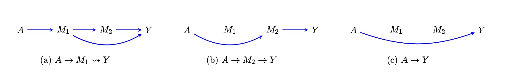

flexPaths: A R Package for Causal Path-Specific Effect Estimation with
Flexible Settings
================
Xiaxian Ou
2024-09-17

- [0. Installation:](#0-installation)
- [1. PSEs for Single Treatment](#1-pses-for-single-treatment)
  - [1.1 `pathsFit`: input needed information for PSEs
    calculation](#11-pathsfit-input-needed-information-for-pses-calculation)
  - [1.2 `pathsEffect`: PSEs through each
    mediator](#12-pathseffect-pses-through-each-mediator)
  - [1.3 `flexEffect`: PSE for flexible combined
    paths](#13-flexeffect-pse-for-flexible-combined-paths)
- [2. PSEs for Multiple Treatments](#2-pses-for-multiple-treatments)
  - [2.1 `pathFit`](#21-pathfit)
  - [2.2 `mpathEffect`](#22-mpatheffect)
  - [2.3 `mflexEffect`](#23-mflexeffect)

This package is built for estimating the causal **path-specific
effects** (PSEs) in mediation analysis with multiple ordered mediators
for one binary treatments or multiple binary treatments. It provides
robust estimators based on influence function theory.

Primary advantages of the package include:

- **Two decomposition strategies**: This package can return the Natural
  PSEs and Cumulative PSEs of most common pathways ([Xiang Zhou,
  2022](https://academic.oup.com/jrsssb/article/84/3/794/7056148)).

- **Flexible pathways**: User can calculate the average potential
  outcome for any identified paths, as well as the average causal effect
  by comparing the average potential outcome.

- **flexible model fitting**: he package supports model fitting using
  `glm/lm`, `twopart`, `bart` from dbarts, `Superlearner` now. Users can
  also integrate new models for estimation by modifying the
  `fl_model_template`.

- **flexible estimators**: Three estimator approaches are
  available—Inverse Probability Weighting (IPW), plug-in G-computation,
  and Efficient Influence Function (EIF). The EIF-based estimator is
  particularly robust against model misspecification, ensuring reliable
  results.

Detailed instructions for using the package are provided below.

# 0. Installation:

``` r
install.packages("devtools")
library(devtools)

install_github("xxou/flexPaths")
library(flexPaths)
```

# 1. PSEs for Single Treatment

Here, we illustrate the case with two mediators $M_1$ and $M_2$ (the
mediator can be high demensional). Let $A$ denote the binary treatment
(0 or 1), $Y$ denote the outcome, and $X$ denote the covariates.


Denote the counterfactual outcome
$\phi(a_1, a_2, a) = Y(a,M_1(a_1),M_2(a_2,M_1(a_1)))$ that would be
observed if $A$ were set to $a$ and $M_1$ and $M_2$ were set to the
natural value they would have taken if $A$ had been $a_1$ and $a_2$,
where $(a_1, a_2, a) \in \{0,1\}^3$. For example, $\phi(0, 1, 1)$ means
what the outcome would be when individuals were treated $A=1$ and their
$M_1$ was set at its natural level as individuals without treated $A=0$.
Besides, $Y(a)$ represents $\phi(a, a, a)$, where individuals take its
natural values for all mediators.

**Decomposition**:

The effect of specific pathway can be defined as a contrast against
$Y(0)$ on a mean scale, and these effects are also called natural
path-specific effect:

- $\rho_{A \rightarrow M_1 \leadsto Y} = \mathbb{E} (\phi(1,0,0)) - \mathbb{E} (\phi(0,0,0))$
- $\rho_{A \rightarrow M_2 \rightarrow Y} = \mathbb{E} (\phi(0,1,0)) - \mathbb{E} (\phi(0,0,0))$
- $\rho_{A \rightarrow Y} = \mathbb{E} (\phi(0,0,1)) - \mathbb{E} (\phi(0,0,0))$

Another way to represent PSEs is to decompose the total effect
sequentially, and these effects are called cumulative path-specific
effect:
$\mathbb{E}(Y(1)) -  \mathbb{E}(Y(1)) =\rho_{A \rightarrow M_1 \leadsto Y}  + \rho_{A \rightarrow M_2 \rightarrow Y} + \rho_{A \rightarrow Y}$

- $\rho_{A \rightarrow M_1 \leadsto Y} = \mathbb{E} (\phi(1,1,1)) - \mathbb{E} (\phi(0,1,1))$
- $\rho_{A \rightarrow M_2 \rightarrow Y} = \mathbb{E} (\phi(0,1,1)) - \mathbb{E} (\phi(0,0,1))$
- $\rho_{A \rightarrow Y} = \mathbb{E} (\phi(0,0,1)) - \mathbb{E} (\phi(0,0,0))$

In the absence of interactions between $A$ and $M$, natural PSEs and
cumulative PSEs yield identical results. However, when interactions are
present, they display different results except the same direct effect.
Meanwhile, natural PSEs cannot be simply summed to represent the total
effect. Therefore, these proportions are not analogous to the
\`\`proportion mediated’’ typically.

**Identified pathways**:



Considering the assumptions of identification, only three pathways above
can be identified in our example. $\rho_{A \rightarrow M_1 \leadsto Y}$
captures the effects of all directed pathways from $A$ to $Y$ through
$M_1$, i.e., $A \rightarrow M_1 \rightarrow Y$ and
$A \rightarrow M_1 \rightarrow M_2 \rightarrow Y$.
$\rho_{A \rightarrow M_2 \rightarrow Y}$ captures the effects of all
directed pathways from $A$ to $Y$ through $M_2$.
$\rho_{A \rightarrow Y}$ captures the direct effect of $A$ on $Y$. For
$K$ ordered mediators, only $K+1$ pathways can be identified which are
$A \rightarrow Y$ and $A \rightarrow M_k \leadsto Y$
($k \in \{1, \ldots,K\}$). $\rho_{A \rightarrow M_k \leadsto Y}$
captures all the effect through $M_k$. The identification formula of
$\mathbb{E}(\phi(a_1, \ldots,a_K, a))$ is

$$ \int y \Big\{ dP(y \mid \overline{m}_K, A=a,x) \prod_{k=1}^K dP(m_k \mid \overline{m}_{k-1},A=a_k,x)  \Big\} dP(x) $$

**Models for Estimation**:

- For IPW approach: To estimate $K+1$ PSEs, we need to fit models to
  estimate propensity score
  $P(A|X), P(A|X,M_1), \ldots, P(A|X,M_1,\ldots,M_K)$.
- For plug-in G computation: To estimate $K+1$ PSEs, we need to fit
  models for outcome regression
  $\mathbb{E}(Y|X), \mathbb{E}(Y|X,M_1), \ldots, \mathbb{E}(Y|X,M_1,\ldots,M_K)$.
- For EIF approach: To estimate $K+1$ PSEs, we need to fit models to
  estimate both propensity score
  $P(A|X), P(A|X,M_1), \ldots, P(A|X,M_1,\ldots,M_K)$ and outcome
  regression
  $\mathbb{E}(Y|X), \mathbb{E}(Y|X,M_1), \ldots, \mathbb{E}(Y|X,M_1,\ldots,M_K)$.

## 1.1 `pathsFit`: input needed information for PSEs calculation

``` r
data("singTreat")
EIF_fit <- pathsFit(data = singTreat, A = "treat", Y = "outcome1", cov_x = c("X1", "X2"),
                    M.list = list(M1 = "med1", M2 = c('med2_1', 'med2_2'), M3 = 'med3'),
                    estimation = "EIF",
                    model.outcome = list(~ glm(family = gaussian())),
                    model.propensity = ~ bart(verbose = FALSE, ndpost = 200)
)
```

## 1.2 `pathsEffect`: PSEs through each mediator

``` r
effect_results1 <- pathsEffect(pathsFit = EIF_fit, decomposition = "refer0", scale = "diff", CI_level = 0.95)
effect_results2 <- pathsEffect(pathsFit = EIF_fit, decomposition = "refer0", scale = "diff", CI_level = 0.95, nboot = 100, m.cores = 6)

effect_results3 <- pathsEffect( pathsFit = EIF_fit, decomposition = "sequential", scale = "diff", CI_level = 0.95)
```

## 1.3 `flexEffect`: PSE for flexible combined paths

potential outcome:

``` r
potential_outcome0 <- flexPotential(pathsFit = EIF_fit, active = c(0, 0, 0, 0))
potential_outcome1 <- flexPotential(pathsFit = EIF_fit, active = c(1, 0, 1, 1))
potential_outcome2<- flexPotential(pathsFit = EIF_fit, active = c(1, 0, 0, 1))
```

use potential outcome to calculate PSE

``` r
flex_results1 <- flexEffect(p1 = list(potential_outcome1, potential_outcome2),
                            p0 = potential_outcome0, scale = "diff", CI_level = 0.95,nboot = 5)
```

# 2. PSEs for Multiple Treatments


**Decomposition**:

**Identified pathways**:

**Models for Estimation**:

## 2.1 `pathFit`

``` r
data("multiTreat")
mfit<- pathsFit(data = multiTreat,
                Y = "Y",
                A = c("t1","t2","t3"),
                cov_x = "X",
                M.list = list(
                  M1 = 'm1',
                  M2 = 'm2',
                  M3 = 'm3',
                  M4 = 'm4',
                  M5 = 'm5',
                  M6 = 'm6'
                ),
                estimation = "EIF",
                model.propensity =list( ~  glm(family = binomial())),
                model.outcome = list( ~SuperLearner(SL.library = "SL.mean",family = gaussian())),
                model.iter  = list(~glm(family = gaussian()))
)
```

## 2.2 `mpathEffect`

## 2.3 `mflexEffect`

The length of the active list corresponds to the number of treatments.
In active1 example, each vector in $a_1, a_2, a_3$ represents values
assigned to $M_1, M_2, ..., M_6$ and $Y$. The first three values are
NAs, indicating that the $a_3$ is between $M_3$ and $M_4$. The longest
path in this scenario is
$A_1 \rightarrow A_2 \rightarrow M_1 \rightarrow M_2 \rightarrow M_3 \rightarrow A_3 \rightarrow M_4 \rightarrow M_5 \rightarrow M_6 \rightarrow Y$.

For active2, the longest path is
$A_1 \rightarrow M_1 \rightarrow M_2 \rightarrow A_2 \rightarrow M_3 \rightarrow M_4 \rightarrow A_3 \rightarrow M_5 \rightarrow M_6 \rightarrow Y$.

``` r
active1 = list(a1=c(0,1,0,0,1,0,0),
               a2=c(1,0,1,1,1,0,0),
               a3=c(NA,NA,NA,1,0,0,0))


active2 = list(a1=c(0,1,0,0,1,0,0),
               a2=c(NA,NA,1,1,1,0,0),
               a3=c(NA,NA,NA,NA,0,0,0))
```

Potential outcome for active1 setting.

``` r
mp1<-mflexPotential(active = list(a1=c(0,1,0,0,1,0,0),
                                  a2=c(1,0,1,1,1,0,0),
                                  a3=c(NA,NA,NA,1,0,0,0)),mfit)
mp2<-mflexPotential(active = list(a1=c(0,0,0,0,1,0,0),
                                  a2=c(0,0,0,1,1,0,0),
                                  a3=c(NA,NA,NA,1,0,0,0)),mfit)
```

PSE : mp1 - mp2

``` r
flexEffect(p1 = mp1, p0 = mp2, scale = "diff", CI_level = 0.95, nboot =2 , m.cores = 8)
```
